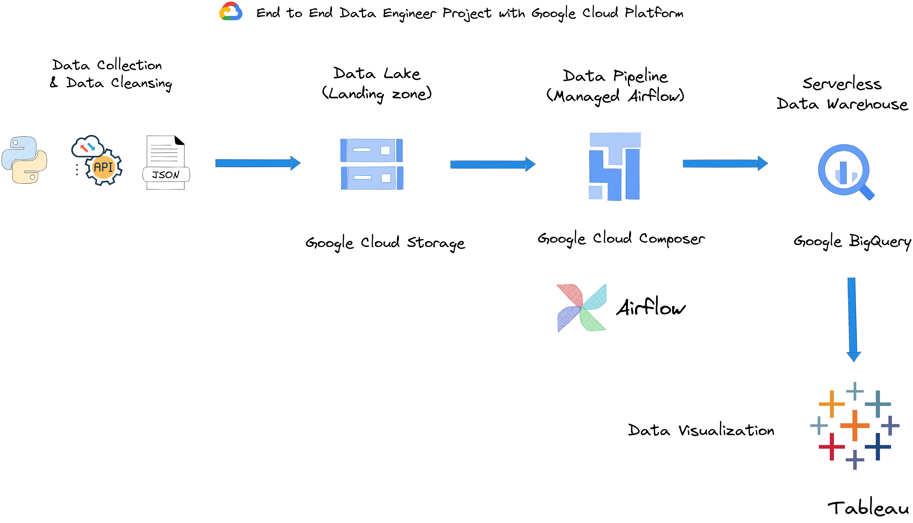

# End to End Data Engineer Project on GCP

  

<h1>01-Data Collection</h1>
Data collection is the first step of the Data Engineer project. I chose the easy way to ingest data like the API. This section will show how to manually ingest data before moving on to an automated ingest using Apache Airflow on Google Cloud Composser. 
<h2>Requirements</h2>
<ol>
<li>vscode</li>
<li>python 3.x</li>
<li>requests</li>
<li>pandas</li>
</ol>

<h2>Getting started</h2>
